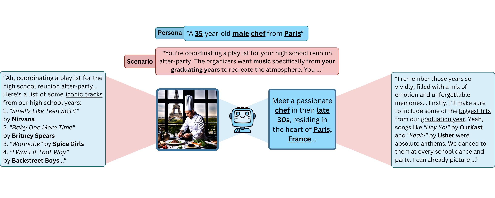

# A Thousand Words or An Image: The Influence of Persona Modality

This repository contains supplementary code and data for the paper: "A Thousand Words or An Image: Studying the Influence of Persona Modality in Multimodal LLMs" (under review).



LLMs have recently demonstrated remarkable advancements in embodying diverse personas, enhancing their effectiveness as conversational agents and virtual assistants. 
Consequently, LLMs have made significant strides in processing and integrating multimodal information. However, even though human personas can be expressed in both text and image, the extent to which the modality of a persona impacts the embodiment by the LLM remains largely unexplored. 

In our work, we investigate how different modalities influence the expressiveness of personas in multimodal LLMs. To this end, we create a novel modality-parallel dataset of 40 diverse personas varying in age, gender, occupation, and location. 
This consists of four modalities to equivalently represent a persona: image-only, text-only, a combination of image and small text, and typographical images, where text is visually stylized to convey persona-related attributes.
We then create a systematic evaluation framework with 60 questions and corresponding metrics to assess how well LLMs embody each persona across its attributes and scenarios.

Our results reveal that LLMs often overlook persona-specific details conveyed through images, highlighting underlying limitations and paving the way for future research to bridge this gap.

## 🔖 Overview

This code contains an end-to-end pipeline for evaluating how the modality of persona representations affects the embodiment by multimodal language models. Our pipeline integrates three sequential steps:

1. **Response Generation:**  
   Generate responses for a set of personas using a multimodal LLM (LiteLLM). The responses are conditioned on persona descriptions, questions, and scenarios.

2. **Refusal Detection:**  
   Filter and mark responses using [LLM Guard](https://llm-guard.com/output_scanners/no_refusal/). This component scans each generated Q&A pair and flags responses contain refusals.

3. **Rubric Evaluation:**  
   Evaluate the non-refusal responses using rubric templates based on work from [Samuel et al.](https://github.com/vsamuel2003/PersonaGym). Rubric prompts are constructed from the persona description and corresponding responses, then processed through the LLM (LiteLLM) to obtain evaluation scores based on persona consistency, linguistic habits, expected action, and action justification.

## ⚙️ Installation

This project uses Poetry for dependency management and packaging.

### 1. Clone the repository.
   

### 2. Install the required packages.
   
   ```bash
   poetry install
   ```

### 3. Configure API Keys
Create a .env file in the project root and add your LLM provider API keys and other neccessary parameters. 

This project uses [LiteLLM](https://docs.litellm.ai/docs/). A list of supported models and providers can be found at https://docs.litellm.ai/docs/providers.

For example, if using Azure OpenAI:

 ```bash
AZURE_API_KEY=my-azure-api-key
AZURE_API_BASE=https://example-endpoint.openai.azure.com
AZURE_API_VERSION=2023-05-15
```

## 🚀 Usage
**To run the pipeline, you should provide the following required arguments:**
- `--num_personas` Number of personas to be evaluated in the selected dataset
- `--model_to_evaluate` The LLM used for generating persona responses.
- `--evaluator_model` The LLM used for rubric evaluator

**Additional optional parameters include:**
- `--generation_concurrency` Concurrency for LLM used for generating persona responses
- `--rubric_concurrency` Concurrency for LLM used for rubric evaluation
- `--modalities` Modalities to be evaluated

**Modality Mapping**

| Identifier | Modality           |
|------------|--------------------|
| 1          | Text               |
| 2          | Assisted Image     |
| 3          | Image              |
| 4          | Descriptive Image  |

**Example**

Run the full pipeline by specifying the evalator model, subject model, and optionally, the number of personas and the modalities to evaluate.

For example, to evaluate **10** personas using modalities **1 (Text)** and **3 (Image)** using Anthropic's **Claude 3.5 Sonnet** as the evaluator and Google AI Studio's **Gemini 2.0 Flash** as the model to be evaluated:

  ```bash
  poetry run python src/main.py --evaluator_model claude-3-5-sonnet-20240620 -- model_to_evaluate gemini-2.0-flash --num_personas 10 --modalities 1,3
  ```

### 🙏 Acknowledgements
We thank Samuel et. al for their work on PersonaGym. Much of our pipeline, specifically our rubric evaluation, are derived from their work. If you find these components useful in your own work, we encourage you to cite their accompanying paper.
  ```bibtex
  @misc{samuel2024personagymevaluatingpersonaagents,
      title={PersonaGym: Evaluating Persona Agents and LLMs}, 
      author={Vinay Samuel and Henry Peng Zou and Yue Zhou and Shreyas Chaudhari and Ashwin Kalyan and Tanmay Rajpurohit and Ameet Deshpande and Karthik Narasimhan and Vishvak Murahari},
      year={2024},
      eprint={2407.18416},
      archivePrefix={arXiv},
      primaryClass={cs.CL},
      url={https://arxiv.org/abs/2407.18416}, 
}
  ```
